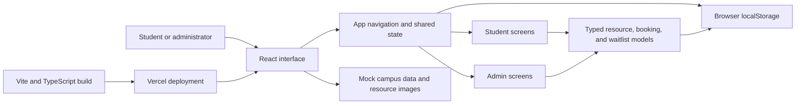
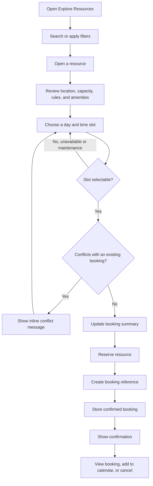
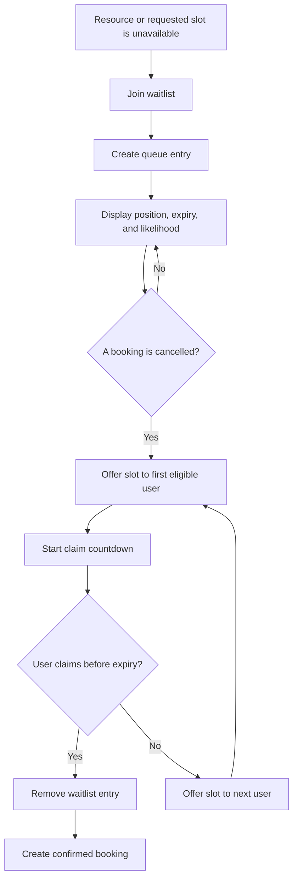

# SlotWise MMU Project Documentation

## 1. Project overview

**SlotWise MMU** is a responsive campus resource booking web application created for the Shortcut Asia Internship Challenge 2026.

The application gives students one place to discover and reserve shared university resources such as study rooms, discussion pods, project spaces, cameras, projectors, and laboratory workbenches. It also gives administrators a clear operational view of bookings, resource utilization, waitlists, maintenance periods, and no-shows.

- **Live application:** [https://slotwise-mmu.vercel.app](https://slotwise-mmu.vercel.app)
- **Source code:** [https://github.com/karimhamzaoui05/slotwise-mmu](https://github.com/karimhamzaoui05/slotwise-mmu)
- **Platform:** Responsive web application
- **Current scope:** Functional front-end prototype with persistent local demo data

## 2. Problem statement

Campus resources are often managed through separate forms, spreadsheets, messaging groups, or manual enquiries. This creates several problems:

- Students cannot easily see which resources are currently available.
- Double-booking and overlapping reservations are difficult to prevent.
- Cancelled reservations may leave resources unused even when other students need them.
- Students have no clear view of their upcoming bookings or waitlist position.
- Administrators lack a single view of occupancy, maintenance, no-shows, and demand.

SlotWise MMU solves this by combining resource discovery, availability, booking management, waitlists, and administration in one interface.

## 3. Target users

### Students

Students need to find an appropriate campus resource, confirm that it is available, and reserve it with as little friction as possible. They can:

- Search and filter available resources.
- Inspect capacity, location, amenities, rules, and operating hours.
- Select a date and time slot.
- See an immediate warning when a selection conflicts with an existing booking.
- View, check in to, edit, or cancel upcoming bookings.
- Join a waitlist when a resource is unavailable.
- Claim a released slot before its countdown expires.

### Campus administrators

Administrators need an operational overview and tools for managing shared resources. They can:

- Review booking and occupancy metrics.
- Monitor pending check-ins, waitlisted users, and no-shows.
- View utilization and booking trends.
- Search and review all resources.
- Add or edit resource information.
- Create maintenance blocks.
- Deactivate unavailable resources.

## 4. Product goals

The project was designed around five goals:

1. **Make availability obvious.** Students should quickly understand what is available and when.
2. **Prevent invalid bookings.** Unavailable, maintenance, and conflicting time slots should not be accepted.
3. **Reduce wasted capacity.** Waitlists allow cancelled slots to be offered to another student.
4. **Support repeated daily use.** Navigation and controls should remain compact, predictable, and responsive.
5. **Demonstrate product thinking.** The prototype includes complete success, warning, empty, confirmation, and administrative states rather than only a happy-path booking form.

## 5. Main features

### Authentication and demo access

- University email and password validation UI.
- Student Demo and Admin Demo shortcuts.
- Role-based navigation: administrative screens appear only for the admin demo.

The current authentication is intentionally simulated so reviewers can access every workflow without credentials or external setup.

### Student dashboard

- Search and quick availability controls.
- Available-now resource cards.
- Upcoming booking summary with check-in actions.
- Current waitlist entries and released-slot alert.
- Daily occupancy indicators and recently booked resources.

### Resource discovery

- Search by resource or building.
- Filters for resource type, building, and capacity.
- Sorting by availability, capacity, or name.
- Grid and list display modes.
- Resource status, capacity, amenities, location, and next available time.

### Availability and booking

- Weekly day selector and hourly time-slot grid.
- Distinct available, selected, unavailable, and maintenance states.
- Conflict feedback for an overlapping selection.
- Live booking summary with date, time, and duration.
- Generated booking reference and confirmation screen.
- Check-in policy and cancellation information.

### Booking management

- Upcoming, past, and cancelled tabs.
- Booking status badges.
- Check-in, edit, cancel, and directions actions.
- Cancellation confirmation dialog.
- Demonstration of edit-time conflict feedback.

### Waitlist management

- Queue position and demand likelihood.
- Expiration information.
- Countdown for a released slot.
- Claim, decline, and leave-waitlist actions.
- Claimed slots are converted into confirmed bookings.

### Administration

- Booking, occupancy, check-in, waitlist, and no-show metrics.
- Utilization and weekly booking charts.
- Today's schedule and recent activity.
- Searchable resource management table.
- Add/edit resource drawer and maintenance dialog.

### Responsive and accessible interface

- Fixed sidebar on desktop and bottom navigation on mobile.
- Responsive cards, tables, forms, and booking controls.
- Visible focus states, semantic form labels, status text, and sufficiently large touch targets.
- Status is communicated with labels and icons, not color alone.

## 6. Technical architecture

SlotWise MMU is a client-side React application deployed as static assets on Vercel.



### Application layers

| Layer | Responsibility |
| --- | --- |
| `src/app/App.tsx` | Top-level navigation, role state, bookings, waitlists, notifications, and persistence |
| `src/app/components/screens/` | Product screens such as Dashboard, Resource Details, Bookings, Waitlist, and Admin |
| `src/app/components/` | Shared navigation, resource cards, and status badges |
| `src/app/types.ts` | TypeScript contracts for resources, bookings, users, statuses, and waitlist entries |
| `src/app/data/mockData.ts` | Realistic MMU-style sample resources and operational data |
| `src/styles/` | Design tokens, global styling, accessibility, and responsive presentation |
| `localStorage` | Prototype persistence for bookings and waitlist entries |

### Core data models

The application uses explicit TypeScript models rather than unstructured objects:

- `Resource` stores identity, type, location, capacity, amenities, operating hours, rules, status, and imagery.
- `Booking` connects a resource to a date, time range, duration, reference number, and lifecycle status.
- `WaitlistEntry` stores the requested slot, queue position, expiry, likelihood, and release state.
- Union types restrict resource, booking, and screen states to known values.

This makes component contracts clearer and allows the compiler to catch invalid state transitions or missing data.

## 7. Booking flow



### Booking validation approach

The prototype blocks known unavailable and maintenance slots and demonstrates overlap feedback using an existing-booking conflict state. In a production backend, the final conflict check would also be performed atomically by the server before insertion.

The standard overlap condition is:

```ts
existingStart < requestedEnd && requestedStart < existingEnd
```

This allows back-to-back bookings while rejecting any time range that actually intersects an existing reservation.

## 8. Waitlist flow



The prototype includes queue position, release notification, countdown, claim, decline, and leave actions. Claiming a slot updates the shared app state so it immediately appears under My Bookings.

## 9. Important technical decisions

### React with TypeScript

React was selected because the product contains many reusable and stateful interface elements. TypeScript was used because Shortcut Asia recommends it and because booking systems benefit from strict models for statuses and transitions.

### Vite instead of a larger full-stack framework

Vite provides a fast development experience and a simple production build for this front-end prototype. The challenge prioritizes a reliable, demonstrable product within a short build period, so avoiding unnecessary server complexity helped keep the work focused.

### Central shared state

Bookings and waitlist entries are managed in `App.tsx` and passed to screens through typed props. This ensures that actions on one screen are reflected elsewhere. For example, claiming a waitlist entry creates a booking that appears in My Bookings.

For a larger application, this could move to a state library or server-backed query cache, but the current approach is easier to understand and appropriate for the prototype's size.

### Local persistence for the prototype

Bookings and waitlists are saved to `localStorage`. This provides a realistic persistent demo without requiring reviewers to configure a database or API.

This is not presented as production security. A live system would use authenticated server APIs and database constraints.

### Reusable components and design tokens

Navigation, resource cards, status badges, colors, typography, and interaction states are reused across the application. This improves consistency and reduces duplication.

### Responsive web application

A responsive web app was selected because students may book from phones while administrators often work on desktops. One codebase supports both use cases and can be deployed through a single public URL.

## 10. Edge cases considered

- Selecting an unavailable or maintenance slot.
- Attempting to select a time that overlaps another booking.
- Cancelling a booking accidentally, handled with confirmation.
- Empty upcoming, past, cancelled, or waitlist states.
- Joining the same resource waitlist more than once.
- A waitlist claim expiring before acceptance.
- Resource maintenance and deactivation.
- Mobile layouts with narrow width and fixed bottom navigation.
- Browser storage containing malformed data, handled by falling back to mock data.

## 11. Challenges and solutions

### Turning a design prototype into maintainable code

The Figma prototype defined the intended product experience but still required shared state, typed models, reusable components, and real interactions. The final implementation separates screen components from application-level state instead of treating every screen as an isolated mockup.

### Keeping state consistent across screens

A booking created on the resource page must appear on the confirmation page and in My Bookings. Likewise, a claimed waitlist slot must be removed from the queue and added to bookings. This was solved by lifting bookings and waitlists to the application shell and using explicit event handlers.

### Parsing selected times safely

Time-slot keys contain both a day and a time, for example `Fri:10:00`. Splitting on every colon would incorrectly reduce the time to `10`. The implementation instead removes only the day prefix, preserving `10:00` and allowing the booking summary to calculate the correct end time.

### Balancing depth and scope

The challenge recommends going deeper rather than broader. The application therefore concentrates on two connected workflows: conflict-aware booking and waitlist recovery. Administrative screens support those workflows without introducing unrelated modules.

### Building a useful demo without external setup

A real authentication and database stack would improve production readiness, but it would also add configuration and failure points for reviewers. Demo access, realistic sample data, and local persistence make the complete workflow immediately testable.

## 12. Current limitations

- Authentication is simulated and does not verify a real MMU account.
- Data is stored in the reviewer's browser and is not shared between devices.
- Resource and admin data starts from mock data.
- Availability is not synchronized between multiple users.
- Email, push notifications, and calendar integration are represented in the interface but are not connected to external services.
- The final booking conflict check is demonstrated client-side rather than enforced by a transactional server.

These limitations are deliberate for a one-week prototype and are clearly separated from the intended production architecture.

## 13. Future improvements

### Highest priority

1. Add Supabase or PostgreSQL for shared persistent data.
2. Implement MMU email authentication and role-based authorization.
3. Enforce booking overlap rules with database constraints or transactions.
4. Add automated unit and interaction tests for booking and waitlist logic.
5. Add server-generated reminders and release notifications.

### Product enhancements

- QR-code or location-based check-in.
- Real email and in-app notifications.
- Calendar export using `.ics` files.
- Recurring bookings for approved users.
- Admin audit logs and downloadable utilization reports.
- Accessibility testing with screen readers.
- Resource recommendations based on capacity, location, and amenities.

## 14. Setup instructions

### Requirements

- Node.js LTS
- npm
- A modern browser such as Chrome, Edge, Firefox, or Safari

### Run in development

```bash
git clone https://github.com/karimhamzaoui05/slotwise-mmu.git
cd slotwise-mmu
npm install
npm run dev
```

Open the local URL printed by Vite, normally:

```text
http://localhost:5173
```

Use **Student Demo** or **Admin Demo** on the sign-in screen.

### Type-check and build

```bash
npm run typecheck
npm run build
```

The production files are generated in `dist/`.

### Preview the production build

```bash
npm run preview
```

### Deployment

The GitHub repository is connected to Vercel. A successful push to the `main` branch triggers a new production deployment automatically.

No environment variables are required for the current prototype.

## 15. Suggested reviewer walkthrough

1. Open the live application and choose **Student Demo**.
2. Review the dashboard and available resources.
3. Open Explore Resources and test search, filters, and view modes.
4. Open a resource and select a valid slot.
5. Select the demonstrated conflict slot to see inline validation.
6. Complete a booking and confirm that it appears in My Bookings.
7. Open Waitlist and claim the released Collaboration Room slot.
8. Sign out and choose **Admin Demo**.
9. Review the metrics and charts.
10. Open Resource Management and test the add/edit and maintenance interfaces.

## 16. Conclusion

SlotWise MMU demonstrates a complete product workflow rather than only a collection of screens. It addresses a realistic campus problem, includes meaningful booking and waitlist logic, handles important edge cases, and provides both student and administrative experiences. The current architecture keeps the prototype simple to run and review while leaving a clear path toward a secure, multi-user production system.
